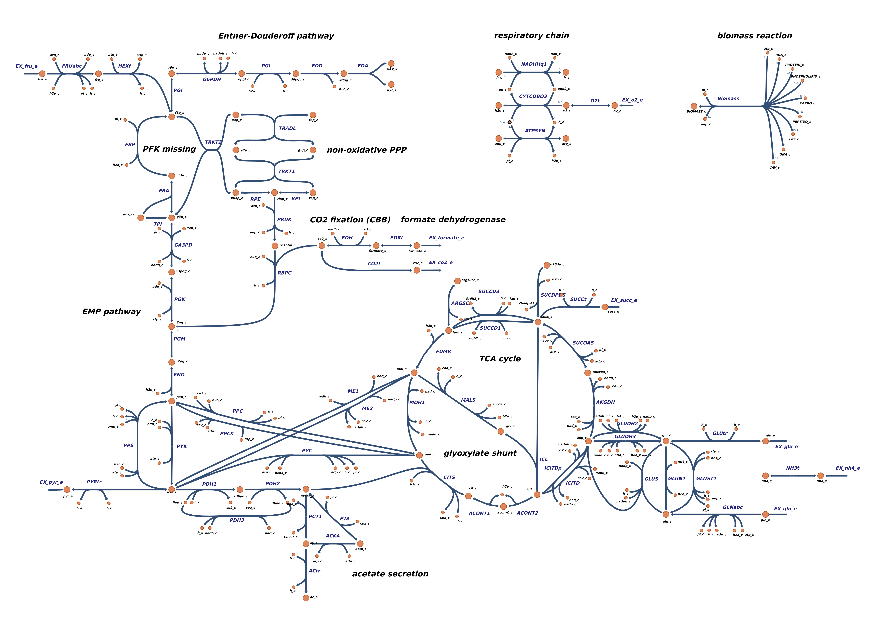
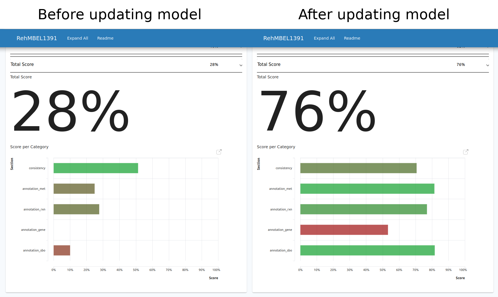
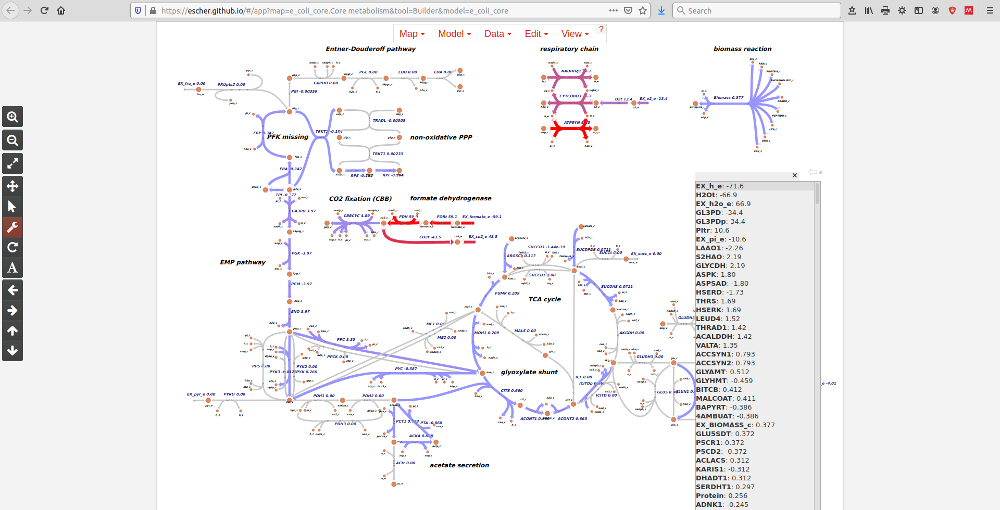

# genome-scale-models

Genome scale metabolic models in SBML format



### Repository contents

#### Models

**_Ralstonia eutropha_** a.k.a. **_Cupriavidus necator_** H16, genome scale metabolic model. The model was previously published in: Park, J. M., Kim, T. Y., & Lee, S. Y. (2011). _Genome-scale reconstruction and in silico analysis of the Ralstonia eutropha H16 for polyhydroxyalkanoate synthesis, lithoautotrophic growth, and 2-methyl citric acid production_. BMC Systems Biology, 5(1), 101. ([link](https://doi.org/10.1186/1752-0509-5-101))


**Changes from original model**

The following changes correct errors, remove unnecessary reactions, or add new reactions. The original model, for example, showed flux through artificial energy generating cycles (see Fritzemeier _et al._, PLOS Comp Bio, 2017). After identification and removal of the following issues, no activity of such cycles was found anymore using FBA.

- There's an artificial NADH generating cycle around the metabolite 1-pyrroline-5-carboxylate dehydrogenase involving 3 reactions, `P5CD4 --> PROD4`/`P5CD5 --> PTO4H --> P5CD4`. The cycle generates 2 NADH per turn. The NADH/NAD cofactor stoichiometry for reaction `P5CD5`/`PROD4` was reversed and was corrected.
- Related to the problem with this reaction is that it is duplicated as `PROD4` (also same gene). The reaction was removed.
- A reaction that seems to contain an error is `NADHDH`, an NADH dehydrogenase that converts UQ spontaneously to UQH2, a reaction that requires NADH canonically (see BiGG reaction: NADHDH). Cofactors were added.
- The TCA cycle reaction succinyl-CoA-synthetase `SUCOAS` is importantly not set to 'reversible' as it's supposed to be, and therefore constrained to wrong direction regarding canonical flow of TCA. Constraints were changed to allow reversible flux.
- Cryptic reactions `P5CD2`, `LEUD3`, `LEUD4`, `4AMBUAT`, `ACOADH2` were removed for teh following reasons. Reaction `P5CD2` seems to have wrong reactants. There is no info on a direct conversion from L-glu to L-glu-5-semialdehyde. All Bigg pathways to L-glu-5-semialdehyde go via `GLU5K` and `G5SD`, the canonical pathway. Reactions `LEUD3/4` seem to be wrong as well. They are annotated as L-leucine dehydrogenase, but convert 3-Methyl-2-oxobutanoate or 3-Methyl-2-oxopentanoate to L-isoleucin or L-Valin. There are however canonical AA synthesis reactions for this purpose, while these reactions participate in artificial cycles. Reaction `4AMBUAT` is annotated as 4-aminobutyrate aminotransferase, but catalyzes transfer of an aminogroup from malonyl semialdehyde to beta-alanine. It forms an artificial cycle with `APAtr` and does not seem to exist in nature. Reaction `ACOADH2` oxidizes praopanoyl-CoA to propenoyl-CoA and is the reverse reaction of `PCNO` (forms artificial cycle).
- The reaction `MICITL` is the last step of the methyl-citrate cycle, an alternative route through TCA from `oaa + propcoa --> succ + pyr`. It carries artificially high flux, so flux of the final reaction was constrained.
- `PYK` is allowed in the model to go in reverse direction (`pyr + atp --> pep + adp`) but this is highly unlikely under physiological conditions (see e.g. wikipedia, or BiGG database). Standard _E. coli_ models also exclude the reverse reaction.
- Several alternative reactions to `PYK` (`PYK1`, `PYK2`, `PYK3`) that carry most likely very little or no flux in _R. eutropha_, were silenced.
- Pyruvate carboxylase `PYC` should only run in direction from `pyr --> oaa`, but not reverse (see E. coli reference models in BiGG).
- PEP carboxylase `PPC` has correct bounds but one H+ reactant too much. The reaction was corrected.
- The biomass equation incorrectly contains pyridoxine as the required cofactor, but the canonical metaboliyte is pyridoxal-5-phosphate (`pydx5p`). Correcting this error prevents an infeasible cycle of reactions where the same enzyme (`H16_A2802`) shows different reaction directionalities for the same metabolites (only difference being phosphorylated or not).
- Together with this error two reactions in pyridoxal phosphate metabolism (`PYR5OXX`, `PYR5OXM`) were set to irreversible, as they were taking part in an artificial O2 generating cycle, and are thermodynamically unlikely to go reverse.
- Two different metabolites, `asp_c` and `aspsa_c`, are labelled with the name of aspartate in the model and take part in different reactions. However `aspsa_c` is in reality L-Aspartate 4-semialdehyde (source: BiGG). This was renamed in the model. The reactions are correct.
- A (dummy) tRNA loading reaction was added for asparagin that was missing; In the original model, tRNA-Asn is made from tRNA-Asp directly. However this does not work properly with RBA models.
- Some reactions (e.g. `CABPS`, carbamoylphosphate synthase) require `hco3` instead of `co2` as substrate for phosphorylation. However, a `co2 <=> hco3` equilibration reaction is missing (see BiGG reaction `HCO3E`). The reaction was added.
- The primary means of fructose uptake seems to be the ABC transporter (ATP dependent import). A second ATP-dependent reaction, fructokinase, then phosphorylates `fru --> f6p`. It is not clear if the alternative PEP-PTS dependent fructose uptake and phosphorylation exists in _R. eutropha_. Therefore the PEP-PTS reaction
was silenced (more details, see Kaddor & Steinbuechel, 2011).
- The original model only contains a lumped reaction for the CBB cycle. In order to include a working CBB cycle, two reactions need to be added, 1) Phosphoribulokinase `PRUK` (cbbP2, H16_B1389; cbbPp, PHG421) catalyzing phosphorylation of Ribulose-5-phosphate: `atp_c + rl5p_c --> adp_c + h_c + rb15bp_c`. And 2) Ribulose-1,5-bisphosphate carboxylase `RBPC` (cbbS2, H16_B1394; cbbL2, H16_B1395; cbbSp, PHG426, cbbLp, PHG427) catalyzing the addition of CO2: `co2_c + h2o_c + rb15bp_c --> 2.0 h_c + 2.0 3pg_c`. The metabolite Ribulose-1,5-bisphosphate was added and the original reaction `CBBCYC` silenced.
- The original model contains a reaction to synthesize a precursor of the essential cofactor thiamin monophosphate (thmmp) using a non-existing pseudo reaction called `MISRXN`, named in the model as 'unclear reaction'. This reaction was removed and replaced by a correct thiazole phosphate synthesis reaction (see Bigg reference reaction `THZPSN`)
- Autotrophic growth (H2 utilization) was implemented by the following changes. Annotation for the existing membrane-bound hydrogenase (MBH, `HYD1` in model) was improved by adding the `hoxKGZ` subunits, see Cramm, 2008. The second and missing reaction, soluble hydrogenase (SH) was added as `HYDS` including gene annotation with `hoxFUYH`. An H2 transporter `H2td` (diffusion) and exchange reaction `EX_h2_e` was added (required new metabolite external H2, `h2_e`).

Other changes regarding to annotation:  

- IDs for 394 metabolites were updated using `cobrapy-bigg-client`
- IDs for 484 reactions were updated using `cobrapy-bigg-client`
- Annotation for 900 metabolites was added using `cobrapy-bigg-client`
- Annotation for 824 reactions was added using `cobrapy-bigg-client`
- Annotation for 1275 genes was added using `bioservices.uniprot` and `bioservices.kegg`
- Names were added for 51 reactions
- 31 duplicated reactions were removed
- Gene reaction rules were changed for 20 reactions
- 7 incomplete gene annotations were removed or corrected (`ugpQ`, `H16_A2326gdpD`, `unknown`, `H16_A024`, `H16_A2911plsC1`, `plsC2`, `spontaneous`) 

**Memote score**

The [Memote web service](https://memote.io/) was used to test the capabilities of the model and identify problems. A comparison was made between the original published model (`Memote_RehMBEL1391_sbml_L2V1`), and the upgraded version of the model with the changes listed above (`Memote_RehMBEL1391_sbml_L3V1`). The memote score **improved from 28% to 76%** owing to the addition of metadata, and correcting many errors. The reports for the original and improved model can be found [here](Memote_RehMBEL1391_sbml_L2V1.html) and [here](Memote_RehMBEL1391_sbml_L3V1.html).



#### Repository structure

The `Ralstonia_eutropha` folder contains the following **folders**:

- `data/` -- folder containing the reference 'model' files with Bigg annotation (`*.json`)
- `escher/` -- folder with map layout and model for [escher](https://escher.github.io/) visualization (`*.json`)
- `memote` -- folder containing the latest memote reports as `*.html` documents
- `sbml/` -- folder containing the original and improved SBML model (`*.xml`)
- `simulations/` -- folder with simulation results tables (`*.csv`)

The `Ralstonia_eutropha` folder contains the following **scripts**:

- `upgrade_model.py` -- functions to import original model and convert to most recent SBML standard. Add reactions and modify erroneous reactions. Add [Bigg](http://bigg.ucsd.edu/) and [uniprot](https://www.uniprot.org/) annotation. Test FBA with COBRApy
- `upgrade_main.py` -- main script for execution of model upgrade
- `get_model_reactions.py` -- function to retrieve and export reaction data
- `flux_analysis.py` -- wrapper functions for FBA, FVA and flux sampling with COBRApy
- `essentiality analysis.py` -- find essential gene set predicted by the model
- `test_simulations.py` -- script to run many simulations at once using COBRApy
- `plot_simulations.R` -- R script to plot results from FBA, FVA, or other simulations


### Getting started

The genome scale metabolic models in this repository are encoded according to [SBML standard](sbml.org) and saved as human-readable `*.xml` or `*.json` files.

The models can have well over 1000 reactions, it is therefore recommended to work with these models using a frame work such as [COBRApy](https://cobrapy.readthedocs.io/en/latest/). To install COBRApy follow the instructions on its [github page](https://github.com/opencobra/cobrapy/blob/master/INSTALL.rst). Installation of additional python 3 dependencies might be necessary for full functionality, such as `libsbml`, `numpy`, 
`scipy`, or `pandas`.

```{b}
# for linux, run the following line in terminal
sudo apt install python3-pip
pip install cobra
```

To work with a model using COBRApy, we can import it in a python session. We can look at the number of reactions, metabolites and genes associated with the model's reactions.

```{python}
# load libraries
import numpy as np
import pandas as pd
import tabulate
import cobra
import os
from os.path import join

# set the path to the model's directory
data_dir = '~/genome-scale-models/Ralstonia_eutropha/'
model = cobra.io.read_sbml_model(join(data_dir, "sbml/RehMBEL1391_sbml_L3V1.xml"))

# summary of the imported model
print('%i reactions' % len(model.reactions))
print('%i metabolites' % len(model.metabolites))
print('%i genes' % len(model.genes))
```


### Structure of SBML models

The `*.xml` files containing the model definition have three (four) major slots:

- metabolite definitions, such as `nadh_c` for NADH or `fru_c` for fructose. 
- reaction definitions that link metabolites to each other. Those define the topology of
  the metabolic network (for example `PYK`: `adp_c + pep_c --> atp_c + pyr_c`)
- groups of reactions that constitute a subsystem, such as all reactions for Citrate cycle
- meta data such as gene-name-reaction associations


### Parameters and constraints

Genome scale models are constrained primarily by two things:
- network topology defined by the set of reactions. Models usually include only the reaction network for low molecular weight metabolites.
- reaction bounds, e.g. ranging from `-Inf` to `+Inf` for reversible reactions. Irreversible reactions would be bounded by `0 < f < +Inf`, so that the reaction is only allowed to proceed in one direction.

In COBRApy, we can look at the bounds of e.g. all exchange reactions (the ones supplying metabolites from the environment), and set them to a different value.

```{python}
# inspect exchange reactions
model.exchanges.list_attr("bounds")

# we can also change bounds for reactions
for reaction in model.exchanges:
    reaction.lower_bound = 0.0
    reaction.upper_bound = 1000.0
```

In contrast to other types of models such as simple [resource allocation models](https://github.com/m-jahn/cell-economy-models), genome scale models usually don't include cellular processes for production of macromolecules. In other words, transcription, translation, and DNA replication are not explicitly included in the model but only appear as abstract, lumped reactions.


### Objective function

The objective function of the model is a variable similar to other variables that are optimized by the solver. However, when solving the model the prime target of the algorithm is to maximize this variable, often the `Biomass` reaction. Units of all reactions are by default in mmol per gDCW per h, but since the biomass reaction is _per definition_ formulated such that 1 mmol biomass equals 1 g biomass, it also represents the specific growth rate μ (g biomass per gDCW per hour, biomass term can be eliminated).

In COBRApy we can tell the solver to optimize (usually: maximize) the flux through any reaction of choice. To maximize growth rate that would be the Biomass equation.

```{python}
# set objective function
model.objective = {model.reactions.Biomass: 1}
```


### Solving the model

Before we can pass the model to the solver and find the optimal flux distribution towards our goal, we have to define a growth medium (a set of exchange fluxes that represent the nutrients available in the outer environment of the cell).

```{python}
model.medium = {
    'EX_mg2_e': 10.0,
    'EX_pi_e': 100.0,
    'EX_cobalt2_e': 10.0,
    'EX_cl_e': 10.0,
    'EX_k_e': 10.0,
    'EX_fe3_e': 10.0,
    'EX_so4_e': 10.0,
    'EX_fru_e': 5.0,
    'EX_nh4_e': 10.0,
    'EX_na_e': 10.0,
    'EX_o2_e': 18.5,
    'EX_mobd_e': 10.0,
    'EX_h2o_e': 1000.0,
    'EX_h_e': 100.0
    }
```

The solver will then analyze the network and find the optimal steady state flux from our input metabolites to biomass.

```{python}
# run FBA analysis
solution = model.optimize()

# print solution summary, the status from the linear programming solver
print([solution, "status: ", solution.status])

# print top 10 forward and backward flux
fluxes = solution.fluxes.sort_values()
print(fluxes[0:10])
print(fluxes[len(fluxes)-10:len(fluxes)])

# quick summary of FBA analysis
print(model.summary())

# summary of energy balance
print(model.metabolites.atp_c.summary())

# summary of redox balance
print(model.metabolites.nadh_c.summary())
```


### Visualization of results using Escher

To visualize simulation results such as those from FBA, it is extremely informative to overlay reaction (flux) data on top of a familiar metabolic map. The open source tool [Escher](https://escher.github.io) can be used for this purpose. It can be used in a python session but just as well as an online tool. Three files are required that can be obtained from a standard SBML model. 

#### Escher workflow

- The model must be exported as a `.json` file. Simply use the COBRAPy command
`cobra.io.save_json_model(my_model, 'my_path/my_model.json')`
- The next step is to draw a metabolic map. One can start with the _E. coli_ default at
[Escher](https://escher.github.io) and successively add/remove/change reactions
- The final step is to load reaction data. The preferred format is a 2- or 3-column `.csv` table with the first column being reaction IDs corresponding to the map, and the second (optionally third) column being flux values.
- Escher also has the possibility to overlay gene/protein expression data or metabolite data.

#### Example



